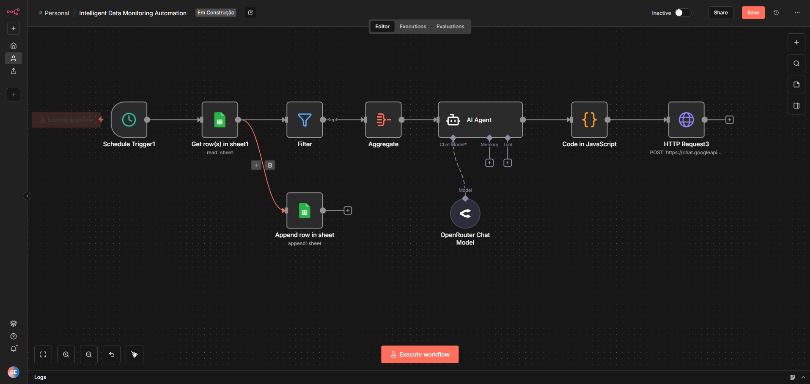
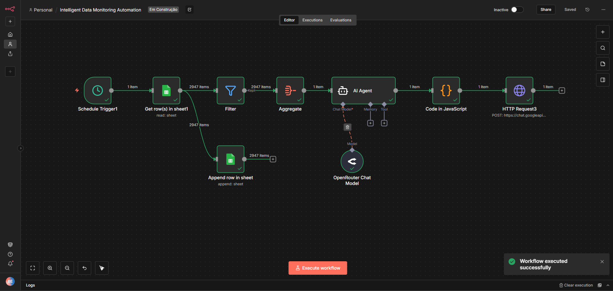
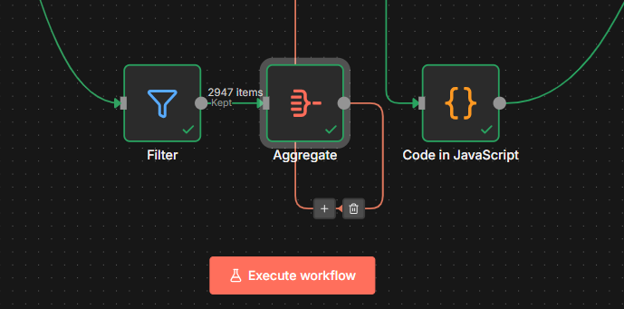
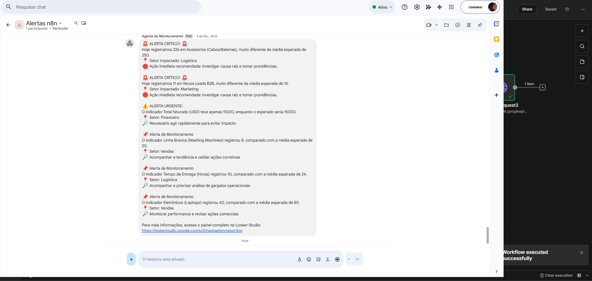

# System Architecture

## Overview

This project implements a modular and automated data monitoring and alerting system built with **n8n**.

The workflow continuously monitors operational and business metrics, applies predefined business rules, and triggers alerts when anomalies or threshold violations are detected.

---

## Data Sources

The system ingests structured data from the following sources:

- Google Sheets (used during development and demonstration)
- CSV or JSON files (sample data only)
- Extensible to APIs or databases

All datasets included in this repository are **fictional** and used exclusively for demonstration purposes.

---

## Data Ingestion

Data ingestion is handled by automated **n8n workflows**, which:

- Fetch data on a scheduled basis
- Validate required fields and schema
- Handle missing or invalid values safely

This step ensures data consistency before any business logic is applied.

---

## Workflow Visualization

The following screenshots illustrate the main n8n workflow and its core components.

### Workflow Overview

This screenshot shows the complete workflow structure, including ingestion, processing, and alerting.

---

### Data Ingestion

This step is responsible for retrieving data from the source and preparing it for processing.

---

## Data Processing & Business Rules

After ingestion, the workflow processes the data by:

- Aggregating key metrics
- Calculating volume changes
- Evaluating thresholds and business rules

All business logic is centralized to ensure clarity and maintainability.

---

## Data Processing & Business Rules

After ingestion, the workflow processes the data by:

- Aggregating key metrics
- Calculating volume changes
- Evaluating thresholds and business rules

All business logic is centralized to ensure clarity and maintainability.

---

## Alerting Mechanism

When a business rule is violated, the system automatically generates an alert.

Alerts include:
- Metric affected
- Type of violation
- Timestamp
- Severity level

Notifications are sent through messaging platforms such as Google Chat or Slack.

---

## Data Storage & Historical Data

Processed metrics and alert results are stored in a structured format to enable:

- Historical analysis
- Trend monitoring
- Auditability of alerts
- Dashboard creation in BI tools

This allows the system to evolve from reactive monitoring to analytical reporting.

---

## Integrations

The architecture supports integration with:

- Business Intelligence tools (Power BI, Looker Studio)
- Databases or data warehouses
- External systems via APIs or webhooks

---

## Design Principles

The system was designed following the principles below:

- Modularity: each workflow step has a single responsibility
- Scalability: new data sources and rules can be added easily
- Observability: alerts and historical data enable full traceability
- Maintainability: business rules are centralized and documented

---

## Architecture Summary

**End-to-end flow:**

1. Data Source  
2. Automated Ingestion (n8n)  
3. Data Processing & Business Rules  
4. Alert Generation  
5. Data Storage (Historical Data)  
6. BI & Analytics Integration  

This architecture provides a scalable and maintainable foundation for intelligent data monitoring.

